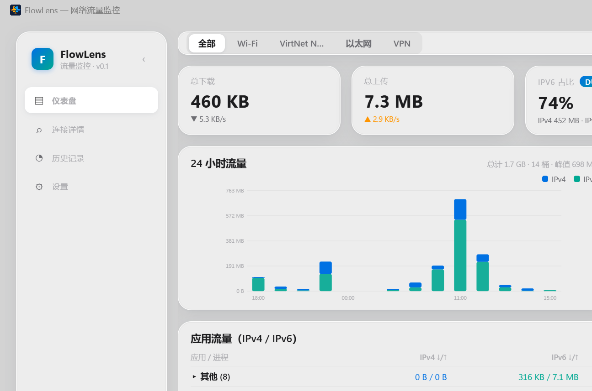
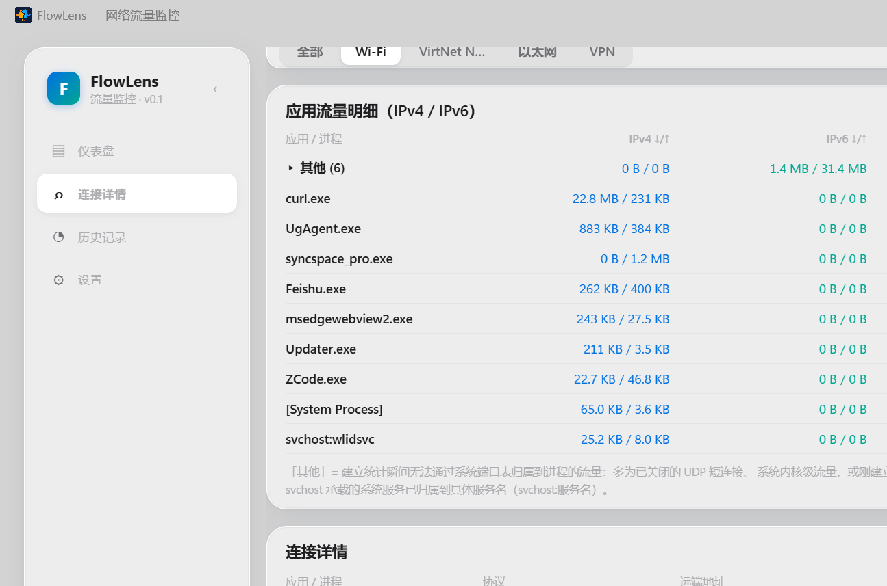

# FlowLens · 流镜

**网络流量监控器** — Liquid-glass styled local network traffic monitor for Windows.

[](LICENSE)


FlowLens 是一款运行于 Windows 的本机网络流量监控工具：pcap 抓包 + SQLite 持久化，
按 **网卡 × IPv4/IPv6 × 收/发方向** 统计流量，按进程归因实时连接，并支持
**任意时间范围**的历史查询与**流量分类**（系统 / 软件 / 开发 / 未归类）。
专为长时间常驻运行设计：抓包热路径零每包分配、进程表增量刷新、内存平稳。



## ✨ 功能特性

- **实时监控** — 实时网速曲线（90 秒采样）、24 小时流量柱状图、实时连接表（按进程归因）、应用流量表（IPv4/IPv6 分列，「其他」可展开）
- **历史查询** — 任意时间范围（今天 / 昨天 / 近 24 小时 / 近 7 天 / 近 30 天 / 本月 / 自定义起止）；≤48 小时自动按小时出桶，更长跨度自动按天出桶；超 90 天自动降级为天粒度（天/月汇总永久保留）
- **流量分类** — 枚举系统已安装软件（注册表 Uninstall 键），将流量归入 **系统 / 软件 / 开发 / 未归类** 四类，范围内提供分类汇总卡与按类筛选的应用明细
- **应用统计** — 应用每日流量永久汇总（单日合计 > 100 MB 才入库，控制数据库体积）
- **常驻设计** — 悬浮窗置顶迷你网速窗、关窗后台持续记录、抓包自动恢复
- **长时运行友好** — 抓包热路径零每包分配、进程表增量刷新、陈旧连接 TTL 剔除，实测连续运行内存平稳（~60 MB）、平均 CPU ~1.4%



## 📦 安装

从 [Releases](../../releases) 下载：

- `FlowLens_x.x.x_x64-setup.exe` — 安装版（含开始菜单快捷方式）
- 或直接运行便携版 `FlowLens.exe`，免安装

**依赖**：本机需已安装 [Npcap](https://npcap.com/)（安装时勾选 *WinPcap API-compatible Mode*），用于抓包。
未安装时应用仍可启动，但无法进行进程级抓包统计。

> 首次启动 Windows 可能弹出防火墙提示，选择"允许"即可。

## 🚀 从源码构建

```bash
# 前置：Rust (stable) + Node.js 18+
npm install
npm run tauri build        # 产出便携 exe + NSIS 安装包
# 或开发调试：
npm run tauri dev
```

产物位于 `src-tauri/target/release/`（便携 exe）与 `src-tauri/target/release/bundle/nsis/`（安装包）。

## 🗄️ 数据与隐私

- 全部数据保存在本地 SQLite，**无任何联网上传**。默认路径 `%APPDATA%/flowlens/traffic_history.db`；设置环境变量 `FLOWLENS_DATA_DIR` 可把数据目录指到其他磁盘（切换后首次启动自动迁移历史数据）
- 分钟级明细与应用小时明细保留 90 天，天/月汇总与应用每日流量永久保留
- 旧版（GlassNet）数据目录会在首次运行时自动迁移

## 🧭 分类说明

| 分类 | 含义 |
|---|---|
| 系统 | Windows 自身流量（svchost 服务、系统更新、Defender 等系统进程） |
| 软件 | 已安装应用（Edge、微信等，按安装目录与产品名匹配） |
| 开发 | 开发工具链流量（node / npm / git / cargo / python 等的下载与拉取） |
| 未归类 | 暂时无法归属到进程的流量与未知程序 |

> 注：按进程归因的固有限制——浏览器内下载 GitHub 资源会计入浏览器所属软件。

## 🏗️ 架构与文档

技术栈：Tauri 2 + Svelte 5（runes）+ Rust（pcap / rusqlite / sysinfo / winreg）。
详细的模块职责、数据流、数据库 Schema 与分类规则见 [docs/PROJECT.md](docs/PROJECT.md)。

## 📄 License

[MIT](LICENSE)
